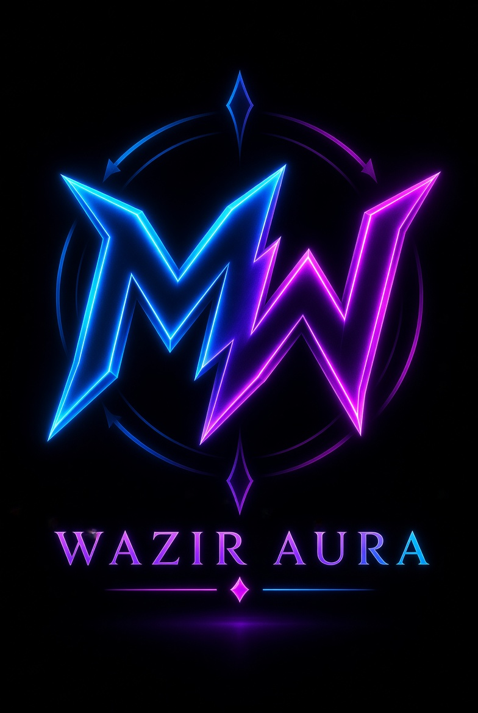

<div align="center">



# WAZIR RESEARCH LAB

### <span style="color:#00d4ff;">Research</span> • <span style="color:#7c3aed;">Technology</span> • <span style="color:#00e5a0;">Solutions</span>

**A professional digital workspace for research, technology, programming, and practical digital solutions.**

<br>

<a href="https://waziraura.github.io/wazirresearchlab/">
  
</a>
&nbsp;
<a href="https://github.com/waxiraura/wazirresearchlab">
  
</a>

<br><br>


</div>

---

# About the Lab

**Wazir Research Lab** is a professional personal website and digital portfolio built around the intersection of **research, technology, programming, data, and web development**.

The platform is designed to present professional capabilities, digital services, projects, research workflows, and useful resources through a clean and modern web experience.

> **Research with purpose. Technology with direction. Solutions that work.**

---

# What I Do

<table>
<tr>
<td width="50%" valign="top">

### Research & Data

* Web Research
* Information Gathering
* Data Collection
* Data Entry
* Data Organization
* Research Support

</td>

<td width="50%" valign="top">

### Technology & Development

* Web Development
* Responsive Web Design
* HTML & CSS
* Programming
* Website Structure
* Digital Solutions

</td>
</tr>

<tr>
<td width="50%" valign="top">

### Documentation

* Research Documentation
* Professional Reports
* Microsoft Word
* Microsoft Excel
* Data Formatting
* Structured Information

</td>

<td width="50%" valign="top">

### Presentation

* Microsoft PowerPoint
* Visual Content Structure
* Professional Layouts
* Digital Presentation
* Portfolio Development
* Online Presence

</td>
</tr>
</table>

---

# Technology Stack

<div align="center">


<br><br>


</div>

---

# Website Experience

The website is designed around a modern, technology-focused interface with an emphasis on clarity, responsiveness, and professional presentation.

| Feature                   | Description                                                    |
| ------------------------- | -------------------------------------------------------------- |
| **Modern UI**             | Premium dark-tech visual language with clean content hierarchy |
| **Responsive Design**     | Optimized for desktop, tablet, and mobile devices              |
| **Professional Branding** | Consistent MW / Wazir Research Lab identity                    |
| **Service Showcase**      | Clear presentation of professional digital services            |
| **Project Presentation**  | Structured display of work, skills, and capabilities           |
| **Mobile Navigation**     | Simple and accessible navigation experience                    |
| **SEO Essentials**        | Sitemap, robots.txt, and verification support                  |
| **Lightweight Structure** | Simple front-end architecture for easy maintenance             |

---

# Website Pages

<div align="center">

|     Page    | Purpose                                                       |
| :---------: | ------------------------------------------------------------- |
|   **Home**  | Main introduction, services, projects, and professional focus |
|  **About**  | Background, skills, goals, and areas of expertise             |
| **Contact** | Professional contact details and service connections          |
| **Privacy** | Privacy and data-related information                          |
|  **Terms**  | Website terms, usage information, and disclaimers             |

</div>

### Live Website

<div align="center">

# [waziraura.github.io/wazirresearchlab](https://waziraura.github.io/wazirresearchlab/)

</div>

---

# Project Architecture

```text
wazirresearchlab/
│
├── index.html
├── about.html
├── contact.html
├── privacy.html
├── terms.html
│
├── sitemap.xml
├── robots.txt
├── googlef557233fb10a849d.html
│
├── MW-logo.png
└── README.md
```

---

# Professional Focus

<div align="center">

### RESEARCH

Web Research · Information Discovery · Data Collection

### DATA

Data Entry · Data Organization · Excel · Structured Records

### DOCUMENTATION

Research Documentation · Word · Reports · Presentations

### TECHNOLOGY

HTML · CSS · Programming · Web Development · Responsive Design

</div>

---

# Professional Presence

<table>
<tr>
<td align="center" width="25%">

### Website

[Visit Website](https://waziraura.github.io/wazirresearchlab/)

</td>
<td align="center" width="25%">

### GitHub

[View Profile](https://github.com/waxiraura)

</td>
<td align="center" width="25%">

### LinkedIn

[Connect](https://www.linkedin.com/in/murad-wazir-bbb0b541a/)

</td>
<td align="center" width="25%">

### Fiverr

[View Profile](https://www.fiverr.com/s/jyjz6rZ)

</td>
</tr>
</table>

---

# Deployment

The website is deployed through **GitHub Pages**.

### Repository

**https://github.com/waxiraura/wazirresearchlab**

### Live Environment

**https://waziraura.github.io/wazirresearchlab/**

---

# Brand Identity

<div align="center">


### Wazir Research Lab

**Research • Technology • Solutions**

**Brand Mark:** `MW`

</div>

The **MW** identity represents the personal brand behind Wazir Research Lab and serves as the core visual mark across the website and related digital presence.

---

# Vision

Wazir Research Lab is built around a simple direction:

> **Combine research, technology, and practical digital skills to create useful, organized, and professional solutions.**

The website serves as a central platform for showcasing capabilities, services, projects, and ongoing digital work.

---

# License

This project and its original materials are created for **Wazir Research Lab**.

Unless otherwise stated, the original design, branding, logo, source content, and custom materials may not be reproduced, redistributed, or commercially reused without permission.

Third-party trademarks, platforms, names, and services remain the property of their respective owners.

---

<div align="center">

## WAZIR RESEARCH LAB

### Research • Technology • Solutions

<br>

<a href="https://waziraura.github.io/wazirresearchlab/">Website</a>
  •   <a href="https://github.com/waxiraura">GitHub</a>
  •   <a href="https://www.linkedin.com/in/murad-wazir-bbb0b541a/">LinkedIn</a>
  •   <a href="https://www.fiverr.com/s/jyjz6rZ">Fiverr</a>

<br><br>

**Built and maintained by Murad Wazir**

<br>

© 2026 **Wazir Research Lab** · All Rights Reserved

</div>
